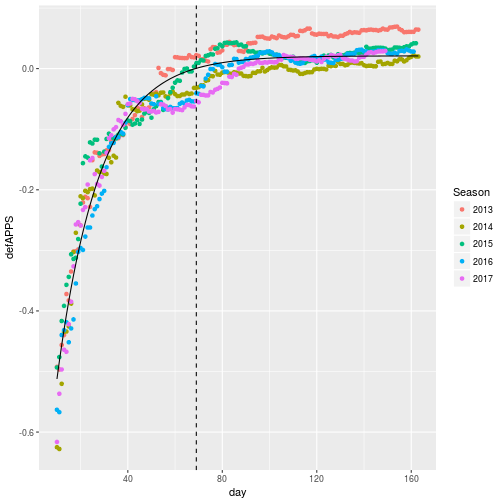

Usando analisis espaciales para entender el Basquetbol
========================================================
author: Derek Corcoran
date: "2017-04-03"

La revolucion estadística en la NBA
========================================================
left: 60%

**Philadelphia 76ers:**
<small>
* Dr. Lance Pearson (Coordinator of Coaching Analytics)
* Sergi Oliva (Director of Basketball Analytics & Innovation)
* Alex Rucker (Vice President - Analytics and Strategy)
* Andy Miller (Senior Researcher)
* Alex D’Amour (Senior Researcher)
* Alex Franks (Senior Researcher)
* Grant Fiddyment (Data Scientist)
* Michael Lai (Data Scientist) 
.</small>

***

2004

=======================================================
incremental: true

* Congreso anual en MIT en Boston
* 11 años
* 4.000 participantes  o
* 1.500 estudiantes de 320 instituciones academicas 
* 130 equipos profesionales 

=============================================

Que es SportsVU
========================================================
incremental: true
left: 60%

***
<small>
- Seguimiento de jugadores en tiempo real con 6 camaras
- Información registrada 25 veces por segundo
- Algunas de los valores registrados
    + Posición
    + Velocidad
    + Distancia a otros jugadores
    + Pases
    + Tipos de tiro
.</small>

Esto permite seguimientos como este
========================================================

y generar datos como este:
========================================================
<small>

|PLAYER_NAME              |SHOT_TYPE      | SHOT_DISTANCE| LOC_X| LOC_Y|SHOT_MADE_FLAG |HTM |VTM |
|:------------------------|:--------------|-------------:|-----:|-----:|:--------------|:---|:---|
|Andre Drummond           |2PT Field Goal |             1|   -17|    -6|0              |ATL |DET |
|Marcus Morris            |2PT Field Goal |            13|   117|    67|1              |ATL |DET |
|Paul Millsap             |2PT Field Goal |            12|    76|    95|1              |ATL |DET |
|Kentavious Caldwell-Pope |2PT Field Goal |             8|   -68|    51|1              |ATL |DET |
|Al Horford               |2PT Field Goal |            20|  -117|   164|0              |ATL |DET |
|Andre Drummond           |2PT Field Goal |             8|   -79|    31|0              |ATL |DET |
|Paul Millsap             |2PT Field Goal |            12|   123|     3|1              |ATL |DET |
.</small>

Todos los tiros del 2017
======================================================

========================================================

========================================================

========================================================

A tale of 2 Shot Charts
========================================

A tale of 2 Shot Charts
========================================

ecuaciones
=========================

$PPS = \frac{Points Made}{Shots Taken}$

=========================
$POA_{i} = PPS_{Team_{i}}-PPS_{League_{i}}$
$APPS =\frac{\sum_{i=1}^{n} (POA_{Offense_i} + POA_{Defense_i})\times ShotsTaken_{Offense_i}}{n\times ShotsTaken_{Offense_Total}}$

<small>
Invirtiendo con el equipo de casa atacando tenemos DefAPPS
.</small>

===================================

Datos colectados
=======================
<small>
* Usamos partidos de temporada regular desde el 2013 hasta el 2017
* Partidos de playoff de 2012 a 2016
* Total de partidos 6,601
* Debido a alta variabilidad en el inicio de la temprorada n final = 4,023
* Total de tiros de análisis 1,174,831
* DefAPPS y OffAPPS calculados para cada partido
.</small>

***

Spread
========================================================

Boosted Regression Trees
========================================================

* Algoritmo de Machine Learning
* Spread ~ OffAPPS + DefAPPS
* Training set de 3,337partidos
* Test set 686 partidos

=======================================================

Comparación con predicciones de las Vegas
========================================================

* Predicciones de las Vegas: RMSE = 14.05, R^2 = 0.29
* Predicciones modelo BRT:RMSE = 15.52, R^2 = 0.13

========================================================

