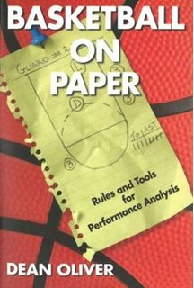
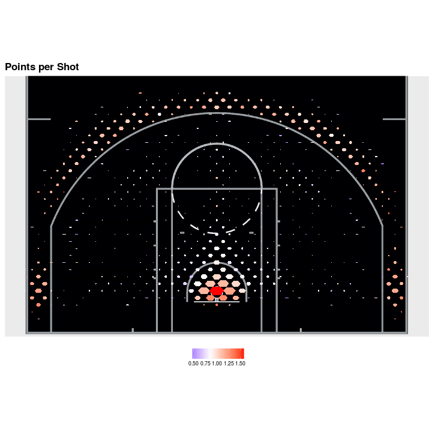
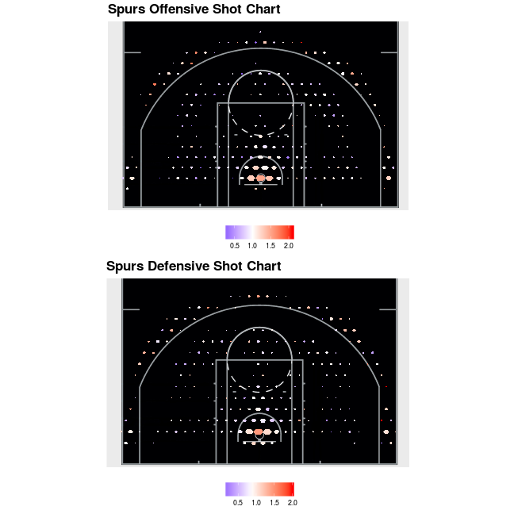

Modelos espaciales para la NBA
========================================================
author: Derek Corcoran
date: "2017-04-02"

La revolucion estadística en la NBA
========================================================
left: 60%

**Philadelphia 76ers:**
<small>
* Dr. Lance Pearson (Coordinator of Coaching Analytics)
* Sergi Oliva (Director of Basketball Analytics & Innovation)
* Alex Rucker (Vice President - Analytics and Strategy)
* Andy Miller (Senior Researcher)
* Alex D’Amour (Senior Researcher)
* Alex Franks (Senior Researcher)
* Grant Fiddyment (Data Scientist)
* Michael Lai (Data Scientist) 
.</small>

***

=======================================================
incremental: true

* Congreso anual en MIT en Boston
* 11 años
* 4.000 participantes  o
* 1.500 estudiantes de 320 instituciones academicas 
* 130 equipos profesionales 

=============================================

Que es SportsVU
========================================================
incremental: true
left: 60%

***
<small>

- Seguimiento de jugadores en tiempo real con 6 camaras
- Información registrada 25 veces por segundo
- Algunas de los valores registrados
    + Posición
    + Velocidad
    + Distancia a otros jugadores
    + Pases
    + Tipos de tiro
.</small>

Esto permite seguimientos como este
========================================================

y generar datos como este:
========================================================

<table>
 <thead>
  <tr>
   <th style="text-align:left;"> PLAYER_NAME </th>
   <th style="text-align:left;"> SHOT_TYPE </th>
   <th style="text-align:right;"> SHOT_DISTANCE </th>
   <th style="text-align:right;"> LOC_X </th>
   <th style="text-align:right;"> LOC_Y </th>
   <th style="text-align:left;"> SHOT_MADE_FLAG </th>
   <th style="text-align:left;"> HTM </th>
   <th style="text-align:left;"> VTM </th>
  </tr>
 </thead>
<tbody>
  <tr>
   <td style="text-align:left;"> Andre Drummond </td>
   <td style="text-align:left;"> 2PT Field Goal </td>
   <td style="text-align:right;"> 1 </td>
   <td style="text-align:right;"> -17 </td>
   <td style="text-align:right;"> -6 </td>
   <td style="text-align:left;"> 0 </td>
   <td style="text-align:left;"> ATL </td>
   <td style="text-align:left;"> DET </td>
  </tr>
  <tr>
   <td style="text-align:left;"> Marcus Morris </td>
   <td style="text-align:left;"> 2PT Field Goal </td>
   <td style="text-align:right;"> 13 </td>
   <td style="text-align:right;"> 117 </td>
   <td style="text-align:right;"> 67 </td>
   <td style="text-align:left;"> 1 </td>
   <td style="text-align:left;"> ATL </td>
   <td style="text-align:left;"> DET </td>
  </tr>
  <tr>
   <td style="text-align:left;"> Paul Millsap </td>
   <td style="text-align:left;"> 2PT Field Goal </td>
   <td style="text-align:right;"> 12 </td>
   <td style="text-align:right;"> 76 </td>
   <td style="text-align:right;"> 95 </td>
   <td style="text-align:left;"> 1 </td>
   <td style="text-align:left;"> ATL </td>
   <td style="text-align:left;"> DET </td>
  </tr>
  <tr>
   <td style="text-align:left;"> Kentavious Caldwell-Pope </td>
   <td style="text-align:left;"> 2PT Field Goal </td>
   <td style="text-align:right;"> 8 </td>
   <td style="text-align:right;"> -68 </td>
   <td style="text-align:right;"> 51 </td>
   <td style="text-align:left;"> 1 </td>
   <td style="text-align:left;"> ATL </td>
   <td style="text-align:left;"> DET </td>
  </tr>
  <tr>
   <td style="text-align:left;"> Al Horford </td>
   <td style="text-align:left;"> 2PT Field Goal </td>
   <td style="text-align:right;"> 20 </td>
   <td style="text-align:right;"> -117 </td>
   <td style="text-align:right;"> 164 </td>
   <td style="text-align:left;"> 0 </td>
   <td style="text-align:left;"> ATL </td>
   <td style="text-align:left;"> DET </td>
  </tr>
  <tr>
   <td style="text-align:left;"> Andre Drummond </td>
   <td style="text-align:left;"> 2PT Field Goal </td>
   <td style="text-align:right;"> 8 </td>
   <td style="text-align:right;"> -79 </td>
   <td style="text-align:right;"> 31 </td>
   <td style="text-align:left;"> 0 </td>
   <td style="text-align:left;"> ATL </td>
   <td style="text-align:left;"> DET </td>
  </tr>
  <tr>
   <td style="text-align:left;"> Paul Millsap </td>
   <td style="text-align:left;"> 2PT Field Goal </td>
   <td style="text-align:right;"> 12 </td>
   <td style="text-align:right;"> 123 </td>
   <td style="text-align:right;"> 3 </td>
   <td style="text-align:left;"> 1 </td>
   <td style="text-align:left;"> ATL </td>
   <td style="text-align:left;"> DET </td>
  </tr>
  <tr>
   <td style="text-align:left;"> Jeff Teague </td>
   <td style="text-align:left;"> 2PT Field Goal </td>
   <td style="text-align:right;"> 15 </td>
   <td style="text-align:right;"> -2 </td>
   <td style="text-align:right;"> 154 </td>
   <td style="text-align:left;"> 0 </td>
   <td style="text-align:left;"> ATL </td>
   <td style="text-align:left;"> DET </td>
  </tr>
  <tr>
   <td style="text-align:left;"> Reggie Jackson </td>
   <td style="text-align:left;"> 3PT Field Goal </td>
   <td style="text-align:right;"> 24 </td>
   <td style="text-align:right;"> -25 </td>
   <td style="text-align:right;"> 239 </td>
   <td style="text-align:left;"> 1 </td>
   <td style="text-align:left;"> ATL </td>
   <td style="text-align:left;"> DET </td>
  </tr>
  <tr>
   <td style="text-align:left;"> Jeff Teague </td>
   <td style="text-align:left;"> 2PT Field Goal </td>
   <td style="text-align:right;"> 1 </td>
   <td style="text-align:right;"> 12 </td>
   <td style="text-align:right;"> 2 </td>
   <td style="text-align:left;"> 0 </td>
   <td style="text-align:left;"> ATL </td>
   <td style="text-align:left;"> DET </td>
  </tr>
  <tr>
   <td style="text-align:left;"> Al Horford </td>
   <td style="text-align:left;"> 2PT Field Goal </td>
   <td style="text-align:right;"> 18 </td>
   <td style="text-align:right;"> -65 </td>
   <td style="text-align:right;"> 169 </td>
   <td style="text-align:left;"> 0 </td>
   <td style="text-align:left;"> ATL </td>
   <td style="text-align:left;"> DET </td>
  </tr>
  <tr>
   <td style="text-align:left;"> Andre Drummond </td>
   <td style="text-align:left;"> 2PT Field Goal </td>
   <td style="text-align:right;"> 6 </td>
   <td style="text-align:right;"> -9 </td>
   <td style="text-align:right;"> 62 </td>
   <td style="text-align:left;"> 0 </td>
   <td style="text-align:left;"> ATL </td>
   <td style="text-align:left;"> DET </td>
  </tr>
  <tr>
   <td style="text-align:left;"> Jeff Teague </td>
   <td style="text-align:left;"> 2PT Field Goal </td>
   <td style="text-align:right;"> 1 </td>
   <td style="text-align:right;"> 15 </td>
   <td style="text-align:right;"> -1 </td>
   <td style="text-align:left;"> 1 </td>
   <td style="text-align:left;"> ATL </td>
   <td style="text-align:left;"> DET </td>
  </tr>
  <tr>
   <td style="text-align:left;"> Andre Drummond </td>
   <td style="text-align:left;"> 2PT Field Goal </td>
   <td style="text-align:right;"> 0 </td>
   <td style="text-align:right;"> 0 </td>
   <td style="text-align:right;"> 1 </td>
   <td style="text-align:left;"> 1 </td>
   <td style="text-align:left;"> ATL </td>
   <td style="text-align:left;"> DET </td>
  </tr>
  <tr>
   <td style="text-align:left;"> Al Horford </td>
   <td style="text-align:left;"> 2PT Field Goal </td>
   <td style="text-align:right;"> 18 </td>
   <td style="text-align:right;"> -30 </td>
   <td style="text-align:right;"> 183 </td>
   <td style="text-align:left;"> 0 </td>
   <td style="text-align:left;"> ATL </td>
   <td style="text-align:left;"> DET </td>
  </tr>
</tbody>
</table>

========================================================

========================================================

N
========================================================

equaciones
=========================

$PPS = \frac{Points made}{Shots taken}$

========================================================

Spread
========================================================

========================================================

